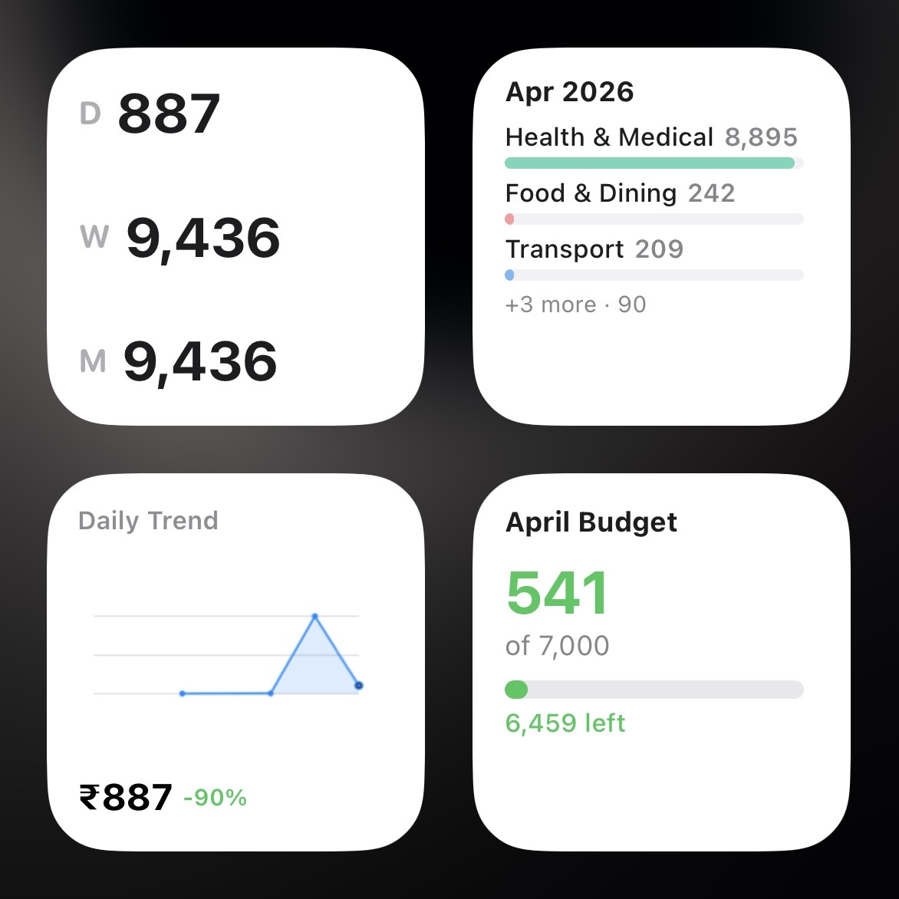
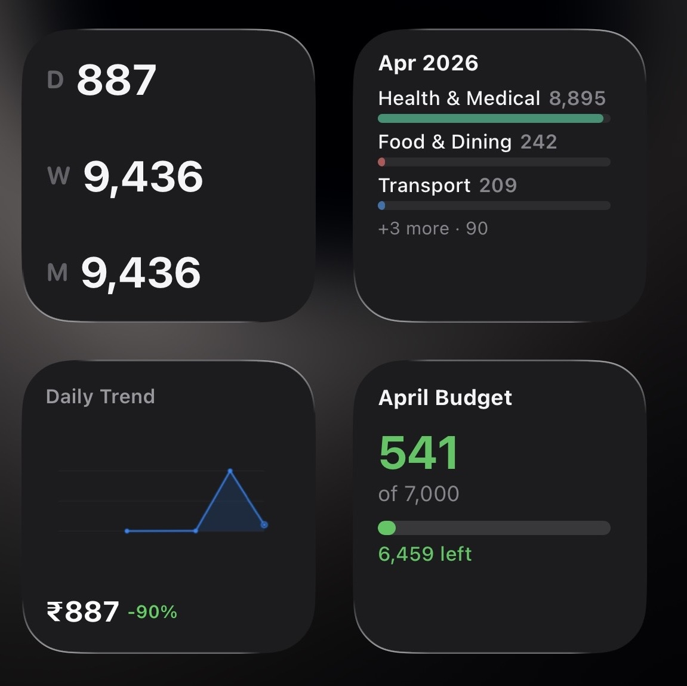
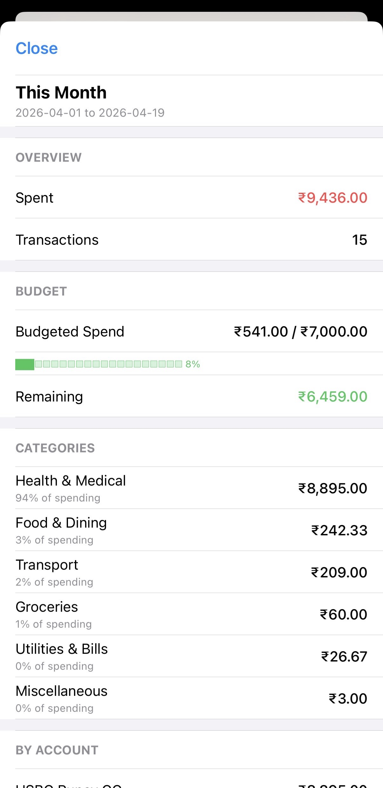
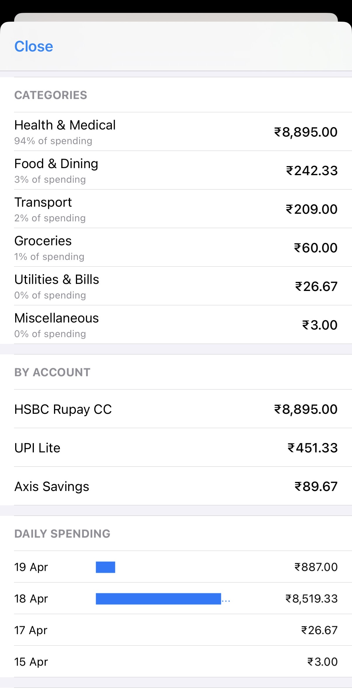

# Expenser

> **AI Disclosure:** This project - including all scripts, guides, and documentation - was written entirely with AI assistance (Claude by Anthropic, via GitHub Copilot). The author designed the system, tested on-device, and directed development. All code generation, debugging, and documentation was AI-produced.

A privacy-first, fully offline iOS expense tracker built with [Scriptable](https://scriptable.app/) (JavaScript) and thin iOS Shortcuts. Designed for India's payment ecosystem - UPI, multiple bank accounts, credit cards, and UPI Lite.

10 scripts. 4 home screen widgets. Zero network calls.

## Features

- **Auto-log from SMS** - bank transaction SMS parsed automatically via iOS Automation
- **Auto-log from email** - credit card and bank transaction emails parsed on arrival
- **Receipt scanning** - snap a photo, extract transaction details using Apple Intelligence (via Private Cloud Compute in Shortcuts)
- **Manual entry** - UPI Lite, cash, or any transaction
- **Self-learning categories** - learns your merchants over time, auto-categorizes repeat purchases
- **Budget tracking** - alerts at 80% and 100% of monthly limits
- **Home screen widgets** - spending summary, category breakdown, budget progress, trend sparkline
- **Transaction dashboard** - searchable list with inline editing (category, merchant, amount, account, notes)
- **Export to CSV** - for spreadsheet analysis
- **Config-driven** - all account matching uses `config.json`, no hardcoded account numbers in code

## Privacy

**Privacy-first.** All transaction parsing, storage, and display happens locally in Scriptable's JavaScript runtime. Zero third-party data sharing. Your financial data stays on your device and your own iCloud Drive. The one exception is receipt scanning, which sends the photo to Apple's Private Cloud Compute for AI text extraction (Apple states this data is not retained or used for training).

The scripts contain no `Request()`, `fetch()`, `eval()`, or `Safari` calls. All processing happens locally in Scriptable's JavaScript runtime.

## Scripts

| Script | Purpose |
|--------|---------|
| `Expenser.js` | Main hub - manual entry, receipt scan, view/search transactions, manage categories, manage accounts, budget settings, export CSV, help guide |
| `SMSParser.js` | Auto-parses bank SMS into structured transactions |
| `EmailParser.js` | Auto-parses bank/CC transaction emails |
| `BankPatterns.js` | Modular bank pattern definitions (regex patterns for SMS and email parsing) |
| `ExpenserDash.js` | Transaction dashboard with inline editing (UITable, not a widget) |
| `ExpenserWidget.js` | Daily / Weekly / Monthly spending summary widget |
| `ExpenserCats.js` | Category breakdown widget with bar charts |
| `ExpenserBudget.js` | Budget progress widget with daily spending hints |
| `ExpenserMoM.js` | Month-over-month sparkline trend widget (auto-switches daily → weekly → monthly) |
| `ExpenserHelp.js` | In-app help guide (rendered locally via WebView) |

## Home Screen Widgets

| Widget | What It Shows |
|--------|---------------|
| Spending Summary | Daily, weekly, or monthly totals at a glance |
| Category Breakdown | Per-category spending with bar charts |
| Budget Progress | Monthly budget usage with daily spending hints |
| Trend Sparkline | Month-over-month trend with auto-scaling time range |

<p align="center">
  
  &nbsp;&nbsp;
  
</p>

### Transaction Dashboard

<p align="center">
  
  &nbsp;&nbsp;
  
</p>

## Supported Banks

Ships with parsing patterns for:

- **HSBC** - savings accounts, credit cards
- **Axis Bank** - savings accounts, credit cards
- **HDFC** - savings accounts, credit cards
- **ICICI** - credit cards

New banks can be added by creating patterns in `BankPatterns.js`. See [guides/06-add-bank-patterns.md](guides/06-add-bank-patterns.md) for an AI-assisted walkthrough, or [guides/bankpatterns_dev_prompt.md](guides/bankpatterns_dev_prompt.md) for the developer prompt reference.

## Architecture

```
Bank SMS       → iOS Automation → SMSParser.js    → expenses.json
Bank Email     → iOS Automation → EmailParser.js   → expenses.json
Receipt Photo  → Shortcut (AI)  → Expenser.js      → expenses.json
Manual Entry   → Shortcut        → Expenser.js      → expenses.json
Home Screen    → Scriptable      → Widget scripts   → Live display
```

- **10 scripts** in Scriptable handle all logic (JavaScript)
- **Shortcuts are tiny** - just a few actions each (call script → show result)
- **2 JSON files** in iCloud Drive - `config.json` (account setup) + `expenses.json` (transaction log)
- **No server, no API** - Scriptable runs JavaScript locally on device

## File Structure

```
expenser/
├── scripts/                # All Scriptable JavaScript files
│   ├── Expenser.js         # Main hub: 10+ features
│   ├── SMSParser.js        # Auto-parse bank SMS
│   ├── EmailParser.js      # Auto-parse bank emails
│   ├── BankPatterns.js     # Modular bank regex patterns
│   ├── ExpenserDash.js     # Transaction dashboard (UITable)
│   ├── ExpenserWidget.js   # Spending summary widget
│   ├── ExpenserCats.js     # Category breakdown widget
│   ├── ExpenserBudget.js   # Budget progress widget
│   ├── ExpenserMoM.js      # Month-over-month trend widget
│   └── ExpenserHelp.js     # In-app help guide
├── guides/                 # Step-by-step setup guides
│   ├── 00-setup.md
│   ├── 01-expenser-hub-shortcut.md
│   ├── 02-sms-automation.md
│   ├── 04-scan-receipt.md
│   ├── 05-email-automation.md
│   ├── 06-add-bank-patterns.md
│   ├── bankpatterns_dev_prompt.md
│   ├── ocr_prompt.md
│   └── statement_sense_prompt.md
├── icloud-samples/         # Template files (copy to iPhone)
│   ├── config.json
│   └── expenses.json
├── reference/              # Pattern documentation
└── readme.md
```

## Setup

Follow **[guides/00-setup.md](guides/00-setup.md)** for detailed steps. Quick overview:

1. Install [Scriptable](https://apps.apple.com/app/scriptable/id1405459188) (free) from the App Store
2. Create folder: `iCloud Drive / Scriptable / expenses/`
3. Copy `config.json` and `expenses.json` from `icloud-samples/` to that folder
4. Edit `config.json` - add your account last-4 digits
5. Copy all 10 scripts from `scripts/` into Scriptable:
   - **Required core (5):** Expenser.js, SMSParser.js, EmailParser.js, BankPatterns.js, ExpenserHelp.js
   - **Dashboard (1):** ExpenserDash.js (run from Scriptable app, not a widget)
   - **Widgets (4, optional but recommended):** ExpenserWidget.js, ExpenserCats.js, ExpenserBudget.js, ExpenserMoM.js
6. Create a file bookmark named `expenser` in Scriptable settings pointing to the expenses folder
7. Edit self-transfer regex: open SMSParser.js and EmailParser.js and replace `your name here` with your actual name
8. Build the iOS Shortcuts and Automations using the setup guides
9. (Optional) Add widgets: long-press Home Screen, tap +, search Scriptable, choose size, configure with widget script

## Setup Guides

| Guide | What It Builds |
|-------|----------------|
| [00-setup.md](guides/00-setup.md) | Install Scriptable, configure files and bookmark |
| [01-expenser-hub-shortcut.md](guides/01-expenser-hub-shortcut.md) | Main Expenser launcher shortcut |
| [02-sms-automation.md](guides/02-sms-automation.md) | Auto-log bank SMS via iOS Automation |
| [04-scan-receipt.md](guides/04-scan-receipt.md) | Receipt scanner shortcut (uses Apple Intelligence) |
| [05-email-automation.md](guides/05-email-automation.md) | Auto-log bank/CC emails |
| [06-add-bank-patterns.md](guides/06-add-bank-patterns.md) | AI-assisted guide to add new bank patterns |

## Configuration

All account detection is driven by `config.json` - no account numbers are hardcoded in the scripts.

Example structure (replace with your own values):

```json
{
  "accounts": {
    "your_bank_savings": {
      "name": "Your Bank Savings",
      "type": "bank",
      "last4": "1234"
    },
    "your_bank_cc": {
      "name": "Your Bank CC",
      "type": "credit_card",
      "last4": "5678"
    },
    "gpay_upi_lite": {
      "name": "GPay UPI Lite",
      "type": "upi_lite"
    }
  },
  "categories": ["Food & Dining", "Groceries", "Transport", "Shopping", "..."],
  "merchant_map": {},
  "budget": {
    "monthly_limit": 5000,
    "excluded_categories": ["Rent & Housing", "EMI & Loans", "Income", "..."]
  }
}
```

> **Note:** The `last4` values above are examples. Replace them with your real account last-4 digits. See `icloud-samples/config.json` for a complete template.

## Customization Notes

- **Self-transfer detection:** `SMSParser.js` and `EmailParser.js` use a regex to detect self-transfers (e.g., transfers between your own accounts). You will need to update the name pattern in these files to match your own name for accurate detection.
- **Adding banks:** Bank-specific parsing patterns live in `BankPatterns.js`. To add support for a new bank, follow [guides/06-add-bank-patterns.md](guides/06-add-bank-patterns.md) - it includes an AI-assisted workflow for generating patterns from sample SMS/email text.

## iOS Shortcuts and Automation

### What works

- **Expenser Hub shortcut** - launches Expenser.js via `scriptable:///run/Expenser` URL scheme. All interactive features (alerts, menus, tables) work because Scriptable opens as the foreground app.
- **SMS automation** - triggers on incoming bank SMS using "Message Contains" filter (e.g., `debited` or `credited`). Runs SMSParser.js via the Shortcuts "Run Script" action. Works in background since parsers only use Notifications, not Alerts. Note: the SMS Sender field does not work reliably on iOS - use "Message Contains" instead.
- **Email automation** - iOS "When I get an email" trigger fires on bank transaction emails. Runs EmailParser.js. Filter by sender address.
- **Receipt scan shortcut** - takes photo, sends it to Apple Intelligence via Private Cloud Compute with a prompt to extract transaction details, then passes the AI response to Expenser.js for parsing. This is the only part where data leaves the device.
- **Home screen widgets** - Scriptable natively supports small/medium/large widgets. Each widget script uses `config.widgetFamily` to adapt layout.

### Known limitations

- **Scriptable "Run Script" action runs in Siri context** - `Alert()`, `UITable`, and text input all crash with "Alerts are not supported in Siri". This is why the Hub shortcut uses the URL scheme (`scriptable:///run/Expenser`) instead - it opens the app in foreground.
- **SMS Sender field does not work** - iOS strips hyphens from bank sender IDs (e.g., `AX-AXISBK-S` becomes `AXISBKS`), so sender-based triggers fail. Use "Message Contains" with keywords like `debited`, `credited`, or your account's last 4 digits instead.
- **Email automation may pass empty content** - some iOS versions don't reliably pass email body text to Shortcuts. If this happens, the parser logs a debug notification to help diagnose.
- **UPI Lite transactions don't generate SMS or email** - GPay UPI Lite payments are silent. Use manual entry or receipt scan for these.
- **Automation requires device unlock** - iOS SMS/email automations that access iCloud files need the device to be unlocked. If locked, the automation queues until next unlock.
- **Automations either run immediately or not at all** - there is no "ask before running" toggle. Set automations to "Run Immediately" or they won't fire.
- **Not all banks are covered** - ships with patterns for HSBC, Axis, HDFC, and ICICI. Other banks need custom patterns (see [guides/06-add-bank-patterns.md](guides/06-add-bank-patterns.md)).

## Contributing

### Add support for your bank

If your bank isn't supported, you can help by submitting masked SMS/email samples:

**[Submit Bank Samples](YOUR_GOOGLE_FORM_LINK_HERE)** (replace this link after creating the form)

See [reference/sms-patterns.md](reference/sms-patterns.md) for examples of what existing bank patterns look like - this shows the exact SMS/email formats used to build parsing logic.

Your samples are used to build parsing patterns. All personal information must be masked before submission - the form includes detailed masking instructions.

You can also add patterns yourself - see [guides/06-add-bank-patterns.md](guides/06-add-bank-patterns.md) for an AI-assisted walkthrough.

### Other contributions

- Improving merchant categorization keywords
- Bug fixes and edge case handling in SMS/email parsing
- Documentation improvements

Please open an issue to discuss significant changes before submitting a pull request.

## License

[MIT](LICENSE)

## Disclaimer

Bank names mentioned (HSBC, Axis, HDFC, ICICI) are trademarks of their respective owners. Expenser is not affiliated with, endorsed by, or connected to any financial institution.
